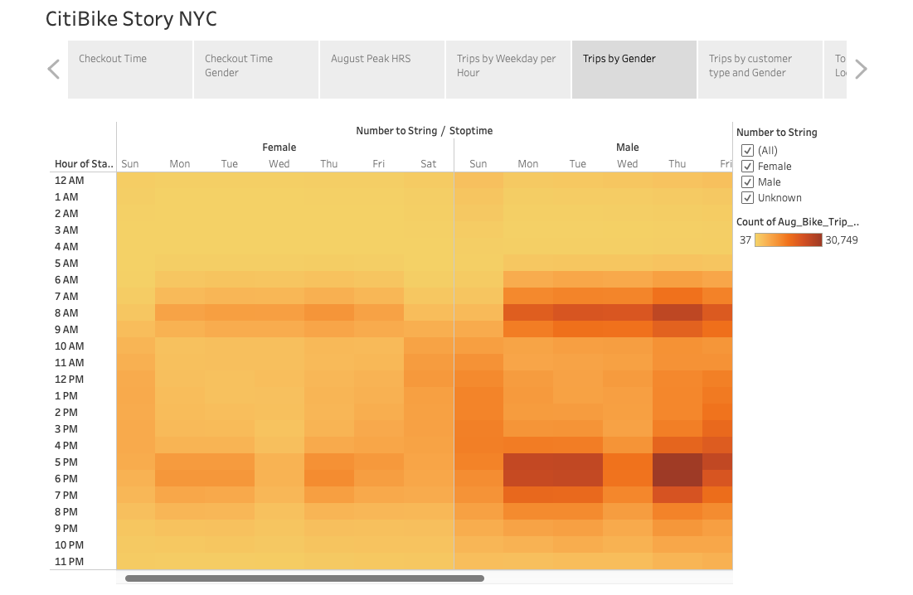

# Bikesharing Tablaeu Analysis

[link to dashboard](LINK GOES HERE "link to dashboard")

## Overview
- During a much need trip into the city, our friend Kate and I saw the convinience of being able to move about the city on a bike that was rentable and had locations everywhere. Although the idea seemed great, we wanted to see how feasible it would be to implemnt in Iowe, the capital where we live of Des Moine. Using python and Tableau to bring the story together, these our findings. 

### Results

- Checkout Times

- What we can gather from this graph and the data it provides us , is that in August which we'll later see is a peak month, the majority of riders rent the bike out for 5 to 15 minutes.

- Checkout Times by Gender 

- The data shows that men overall use the service more than any other gender. This is important because when marketing the service we know who the main audiance is. 

- August Peak Times

- During August the data tells us that the main times people used that service was 8am and 9 am, along with 5pm - 7pm. We can conclude that these are people using the service to get to and from wrok as the times allign with common rush hours.

- Trips by Weekday per Hour

- Using a heatmap we were able to better see how the riders used the services throughout the week. During the week it was most often used during rush out times as stated in the previous picture. However during the weekend we see a more stable use throughout the day, this can be due to people using the service for leisure and to tour the city. 

- Trips by Gender 

- The heatmap above reassures us of the statement made earlier that males used the service moreso than any other gender. 

- Trips by Customer type and Gender

- As we can see, males also are the promidant subcriber of the service using it heavily during the weekend and a little lighter on the weekend. The common customer uses the service less than the subcriber. 

- Top Starting Locations 

- We can see what the hottest spots are that people usually start their journey. THis is helpful because if any repairs or upgrades need to be made it would be better suited to upgrade these locations first.

- Top Ending Locations 

- We can also see which locations are used for drop off the bikes at the end of the user's journey. This is helpful for the same reason as above. 

## Summary:

- The analysis we built during this projects allowed us to see very important business metrics such as who our traget audiance should be, what locations were the most popular for the service, the fact that the subscription method works very well for this type of business. 

- Kate and I's idea to bring this service to our home town is great, because although not many people vacation in Iowa, Des Moines is among one of the most if not, the most popular city in the state, this leaves lots of room for opportunity with the tourist. Although i am not convinced that a subscription model would work as well in a city that isnt as commuter friendly as NYC, I do understand that with gas prices going up, and people being tight for cash, this might give people a new outlet for commuting. 

- I think another great data point that can be made, would be if we had the financial data, this would allow us to us the checkout times, to see if added a discount during non peak hours would incentivize people to use the service. 
